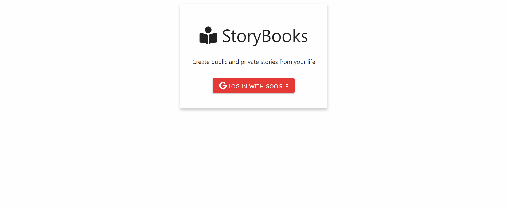

# storiesApp
this a crud application using node.js for adding/deleting and updating stories from different users, by implementing  google Oauth passports with mongodb and mongoose 

# resumed features :
  <ul>
    <li> Google Oauth with passport.js authentication </li>
    <li>woringwith express handlebars templatin engine without need for complex front end(with React or Vue...) </li>
    <li> Users managment system </li>
    <li> Stories dashboard for each user to create/update/delete their stories  </li>
    <li> add a public stories section whicbcontaine all public users stories,  </li>
    <li>Managing public and private stories(private are shown in public stories section, private are not) </li>
    <li>Story description page </li>
    <li>possibility if showing only a specific user stories by clicking n the user name in story </li>
  </ul>

# Demo : 

